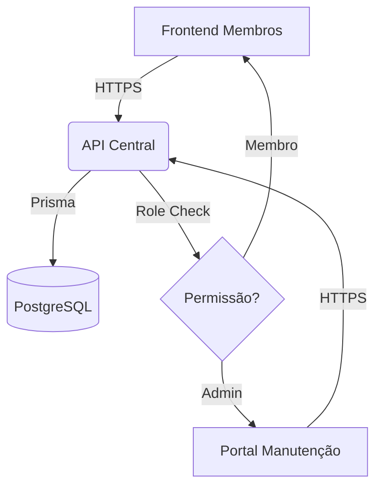

# Estrutura e Separação de Domínios - Mergulho Connect

Este documento detalha como gerenciar o projeto Mergulho Connect em domínios separados (Frontend Público e Portal de Manutenção) mantendo a comunicação com um único backend central.

## Arquitetura Proposta

Para uma separação profissional e segura, utilizaremos a seguinte estrutura:

1.  **Backend (API)**: `api.ccmergulho.com` (NestJS)
2.  **Frontend (Membros)**: `app.ccmergulho.com` (React/Vite)
3.  **Portal de Manutenção**: `manutencao.ccmergulho.com` (React/Vite)

---

## 1. Configuração do Backend (CORS)

O backend é o ponto central. Como as requisições virão de domínios diferentes, o CORS (**Cross-Origin Resource Sharing**) deve estar configurado para aceitar ambos.

### Arquivo `.env` do Backend
No servidor de produção, você deve listar todos os domínios permitidos:

```env
PORT=3001
NODE_ENV=production
# Liste os domínios separados por vírgula (sem espaços)
CORS_ORIGINS=https://app.ccmergulho.com,https://manutencao.ccmergulho.com
```

### Por que isso é necessário?
O navegador bloqueia requisições feitas de um domínio (manutencao.com) para outro (api.com) a menos que a API diga explicitamente que aquele domínio é confiável.

---

## 2. Configuração dos Frontends (VITE_API_URL)

Cada frontend é uma aplicação independente. A única coisa que eles precisam saber é onde a API está localizada.

### Portal de Manutenção (`maintenance-portal/.env`)
Crie um arquivo `.env` na raiz da pasta do portal:

```env
VITE_API_URL=https://api.ccmergulho.com/api
```

### Frontend Principal (`frontend/.env`)
Faça o mesmo no frontend principal:

```env
VITE_API_URL=https://api.ccmergulho.com/api
```

---

## 3. Segurança e Autenticação

Ambas as aplicações usam o mesmo sistema de JWT (JSON Web Token). 

-   **Tokens Independentes**: Cada portal armazena seu próprio token no `localStorage`.
    -   Frontend: `mergulho_auth_token`
    -   Manutenção: `maintenance_auth_token`
-   **Controle por Roles**: O backend valida se o usuário que está tentando acessar uma rota de manutenção tem a role `admin` ou `admin_ccm`. Se um usuário comum (role `membro`) tentar usar o token dele no portal de manutenção, o backend retornará `403 Forbidden`.

---

## 4. Guia de Deploy

### Passo 1: Deploy do Backend
1.  Hospede o backend (ex: VPS, Heroku, Railway).
2.  Configure o subdomínio `api.ccmergulho.com`.
3.  Certifique-se de que o banco de dados PostgreSQL está acessível.

### Passo 2: Deploy do Frontend Principal
1.  Gere o build: `npm run build`.
2.  Hospede a pasta `dist` (ex: Vercel, Netlify, Hostinger).
3.  Configure o domínio `app.ccmergulho.com`.

### Passo 3: Deploy do Portal de Manutenção
1.  Gere o build: `npm run build`.
2.  Hospede a pasta `dist` em um local diferente ou subdomínio.
3.  Configure o domínio `manutencao.ccmergulho.com`.

---

## Resumo de Comunicação



> [!IMPORTANT]
> **HTTPS**: Em produção, é obrigatório o uso de HTTPS em todos os domínios. O navegador bloqueará a comunicação se você tentar misturar HTTP com HTTPS.

> [!TIP]
> **Variações de Porta**: Se for testar em uma mesma máquina com domínios diferentes (via arquivo `hosts`), lembre-se de que portas diferentes contam como "Origins" diferentes para o CORS.
